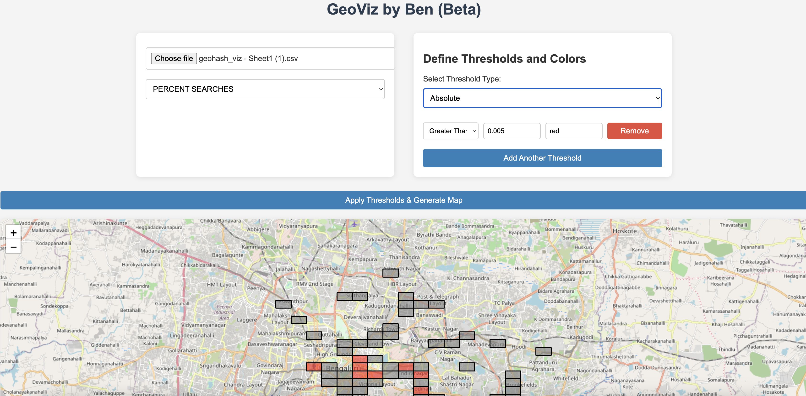

<<<<<<< HEAD
A sample command-line application with an entrypoint in `bin/`, library code
in `lib/`, and example unit test in `test/`.
=======
# GeoViz by Ben

GeoViz by Ben is a geohash visualizer built with Flask and Folium. It allows users to visualize geospatial data on an interactive map. By inputting a dataset with a `geohash` column and additional metrics, users can set custom color thresholds to visually represent those metrics across geographic regions.



## Features

- Upload datasets with geohash-based data.
- Visualize metrics across geohashes on a Folium map.
- Customize color thresholds for different metrics.
- Interactive map with zoom and pan functionalities.

## Prerequisites

Make sure you have the following installed:

- Python 3.7 or higher
- Pip (Python package manager)

## Installation

Follow these steps to set up the project locally:

### 1. Clone the Repository

```bash
git clone https://github.com/BenRoshan100/GeoViz.git
cd GeoViz
```

### 2. Set Up Virtual Environment

Create and activate a virtual environment to isolate project dependencies:

```bash
# Create a virtual environment
python3 -m venv venv

# Activate the virtual environment
source venv/bin/activate
```

### 3. Install Dependencies

Install all required Python packages by running:

```bash
pip install -r requirements.txt
```

 ### 4. Run the Application

Start the Flask server locally:

```bash
python3 app.py
```

By default, the app will run on http://localhost:5000.

### 5. Troubleshooting: Address Already in Use (Port 5000)

If you encounter an error stating that the address is already in use, the port 5000 may be occupied by another process. You can either stop that process or start the app on a different port.

a. Run the following command to find the process ID (PID) using port 5000:

```bash
lsof -i :5000
```

b.	You’ll get an output showing the process ID (PID). Use the kill command to stop it:

```bash
kill -9 <PID>
```

c.	After stopping the process, restart the Flask app.

## How to Use GeoViz by Ben

### 1. Prepare Your Dataset

	•	Ensure your dataset has a geohash column and one or more metric columns.
	•	You can upload this dataset to the app and visualize these metrics based on different thresholds.

### 2. Visualize Geospatial Data

	•	Select the metric you want to visualize on the map.
	•	Define color thresholds for different ranges of the selected metric.
	•	View the output on an interactive Folium map, where each geohash area will be colored based on the thresholds.

## Contributing

Feel free to fork this repository and submit pull requests to contribute to the project.

## License

This project is licensed under the MIT License. See the LICENSE file for details.
>>>>>>> f9b840a843e4d05a5748ebb4d401fe3358d979df
